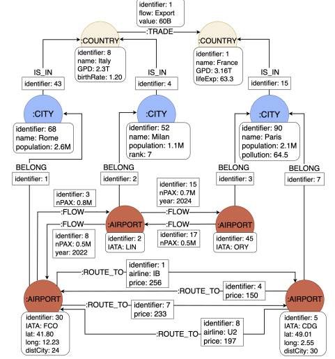
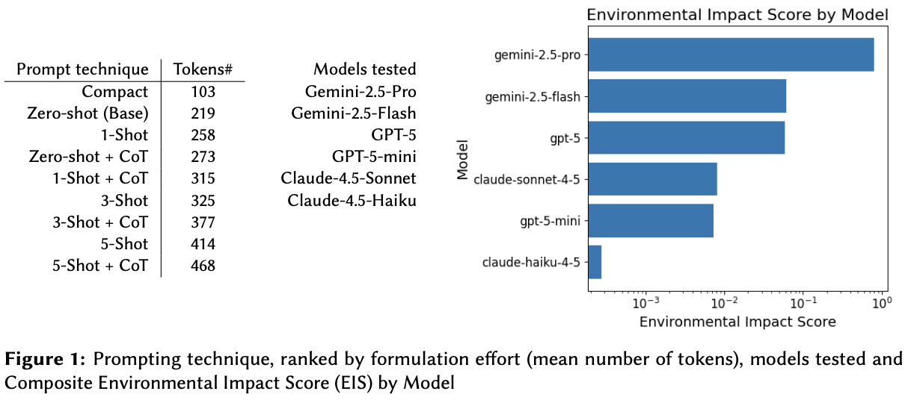
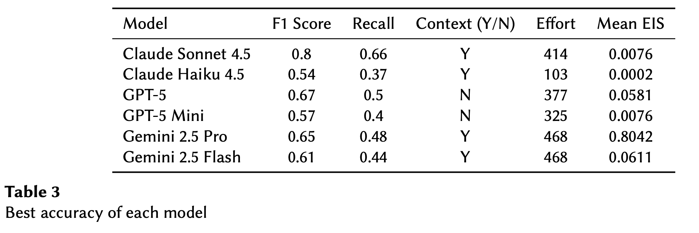
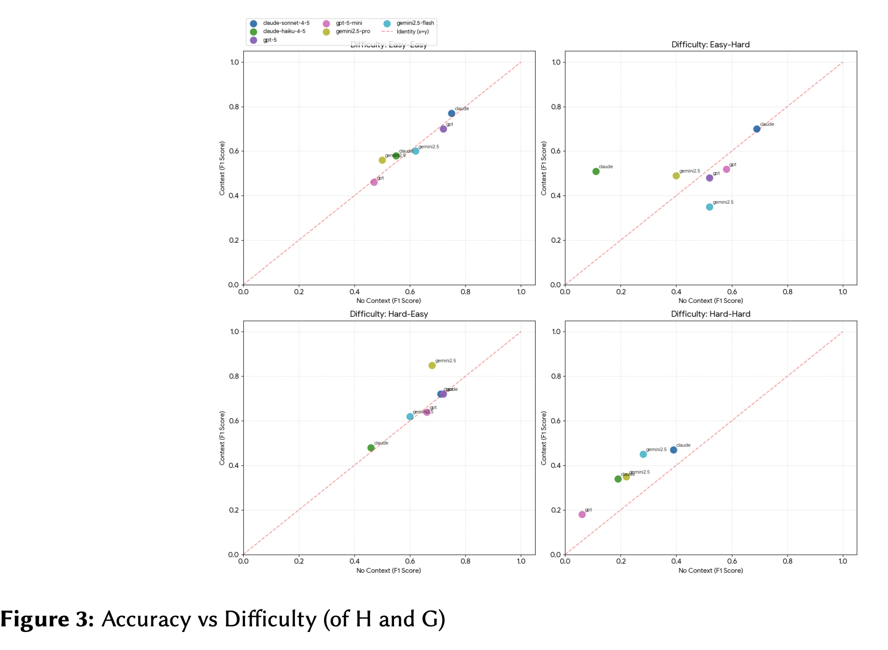

## Property Graph Augmentation using LLMs

This repository is related to the "On the Efficacy of Using LLMs for Context Driven Entity Augmentation in Property Graphs" paper published at DOLAP 2026 Workshop [DOLAP 2026 Workshop](https://dolapworkshop.github.io/dolap-2026/) at [EDBT26 Conferencek](https://edbticdt2026.github.io/). 

This paper investigates the use of large language models (LLMs) to complete missing attribute values in property graphs. We propose an experimental protocol to evaluate LLM-based data augmentation in terms of accuracy, prompting effort, and environmental impact, and introduce a difficulty metric inspired by perplexity.

### Authors 

Authors: Felipe Vasconcelos (1) Cristina Aguiar (1), Alexandre Chanson (2), Mirian Halfeld-Ferrari (3),
Patrick Marcel (3), and Verónika Peralta (2)

1. ICMC, University of São Paulo, São Carlos, Brazil
2. LIFAT, Université de Tours, France
3. Université d’Orléans, INSA CVL, LIFO, UR 4022, Orléans, France


### Reference

TBD

### This repository

This repository is divided into the following folders:

* Datasets/Ranks: Contains code responsible for producing the ranking for properties and entities using the ground truth
* Datasets/Sustainability: Contains code responsible for generating how much energy each prompt and model consumes. We calculate sustainabilty measures using the EcoLogits lib.
* Datasets/Tokens: Contains code responsible for generating how many tokens each prompt and provider generates.
* Main: Contains code responsible for running the proposed protocols and its helping functions
* Prompts: Contains file texts with the used prompts


### Our dataset

We built a property graph database on air routes and trade, comprising three node types: Airport nodes with geographic coordinates and ICAO codes; City nodes with population (in millions) and pollution indices; and Country nodes characterized by numerical indicators such as GDP and birth rate. A Neo4j dump is available in this repository.




### Running

#### Requirements

his code has been tested with Python 3.12, and Neo4J 5.x, to install the required packages we recommend the use of a python virtual environement.

```python
python -m venv venv
source venv/bin/activate
pip install -r requirements.txt
```

#### Enviroment keys

You need to create a .env file for running this code. The file .env.example contains the template for the API keys and hosts for each provider. 

```
GOOGLE_API_KEY=''
AZURE_API_KEY=""
AZURE_API_ENDPOINT=""
OPENAI_API_KEY="
ANTHROPIC_API_KEY=""
DB_HOST=""
DB_PASSWORD=""
DB_USER=""
DB_NAME=""
```

#### Experiments

**Models**

We evaluate Gemini-2.5-Pro, Gemini-2.5-Flash, GPT-5, GPT-5-mini, Claude-4.5-Sonnet, and Claude 4.5-Haiku. We exclude Gemini-3-Pro, as it does not provide a smaller counterpart (at the time of the paper), and Claude Opus, following Anthropic’s recommendation to use Sonnet for general-purpose tasks.

**Providers**

We use the official clients for each provider, thus, you only need to change the API keys and endpoints for the respective provider. Here are the official provider for each model:

**Context generation**

In our experiments, we use a context generation method for nodes based on the following paper: *["AGUIAR, Cristina et al. Extracting node comparison insights for the interactive exploration of property graphs. arXiv preprint arXiv:2512.15157, 2025."](https://arxiv.org/abs/2512.15157)*

The code responsible for generating the context of a node in a property graph can be found in this [repository](https://github.com/AlexChanson/Comparing-Nodes)

#### Code

The main.ipynb notebook is responsible for running the experiment protocol defined in the paper. 

#### Discussions

**Enviromental cost** 

An overall environmental efficiency ranking based on this composite EIS is presented in Figure 1 (right), where lower values indicate lower relative environmental impact. The results show that the Gemini models exhibit the highest impact scores, while smaller models like Claude-Haiku-4.5 and GPT-5-mini achieve the lowest scores. Figure 2 presents the EIS of our different prompting techniques for the selected models. The results indicate that prompting strategies can induce substantial differences in energy consumption independently of prompt length or apparent complexity, depending on how effectively additional context constrains model generation and reasoning. 



**Accuracy**

Table 3 reports the best accuracy for each model with the corresponding
effort and the EIS normalized with log minmax and bound to 0-1. It can
be seen that all models struggle to achieve a F1 score greater than 0.8. 



Figure 3 plots accuracy vs difficulty of H and G for all the models tested, with and without context (same definitions as above). Difficulty of H and G is given as: Easy (property popularity in the fourth quartile) and Hard (property popularity in the first quartile). It can be seen that accuracy decreases with difficulty, as expected, and that context is useful when difficulty is high (hard-hard quadrant, where
accuracy is systematically above the diagonal).



**Conclusion**

This paper propose an experimental protocol to evaluate LLM-based data augmentation tasks of various difficulties in property graphs, in terms of accuracy, prompting effort, and environmental impact. Our preliminary results show that most of the models tested struggle with such tasks and that context is useful for difficult tasks, with variations in the model and prompting strategy used.


